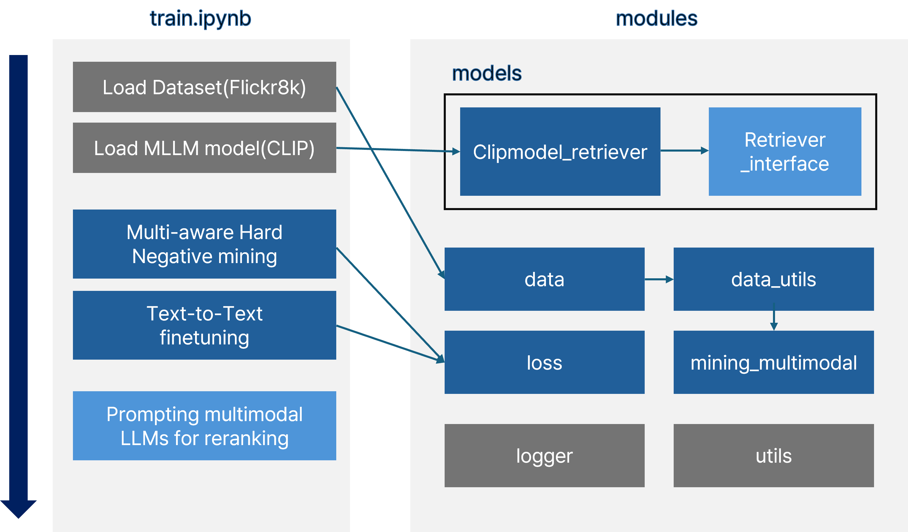

# MM-Embed: Universal Multimodal Retrieval with Multimodal LLMs

`paper` https://arxiv.org/abs/2411.02571

NVIDIA의 `MM-Embed: Universal Multimodal Retrieval with Multimodal LLMs` 논문의 내용 실습 코드다. 해당 논문의 핵심 기법은 다음과 같다.
1. Modality-aware Hard Negative mining
2. Text-to-Text fine-tuning
3. Prompting and reranking

이 리포지토리는 1번과 2번 위주로 구현하였으며, 논문에서 제시한 실제 모델과 데이터를 사용하기에는 학습 환경의 자원이 부족했기 때문에 별도의 더미 데이터와 MLLM보다 가벼운 모델을 사용하여 구현하였다.

3번 `Prompting and reranking`은 논문에서 제시한 방법의 스코어 계산 class를 `train.ipynb`에 작성하였다. 논문에서는 `LLaVa-Next`를 사용하였으나, 이 코드에서는 `GPT2`를 사용했다.

# Code Implementation

### 활용 모델: CLIP model
MLLM 모델의 용량이 크기 때문에 실질적으로 논문 구현이 어려워 경량화된 모델을 필요로 했다. 이에 따라 `CLIPmodel`의 `text encoder`와 `image encoder`를 사용하여 구현하였다.

`modules/models/Retriever_interface.py`의 `RetrieverInterface` 클래스를 상속하여 학습용 retriever class를 구현하면 다른 모델로도 실습이 가능하다.

### 데이터셋: Fickr85
실제 논문 학습에 사용된 데이터는 M-BEIR 기준 560만개 데이터로 실질적으로 일반 환경에서 검증을 하기 어렵다. 이에 따라 Flickr8k데이터를 사용하여 임의의 dummy dataset을 구축하여 검증 진행하였다.

Text-to-Text 데이터셋 또한 Flickr8k 데이터에서 image를 제외하여 구축하였다.